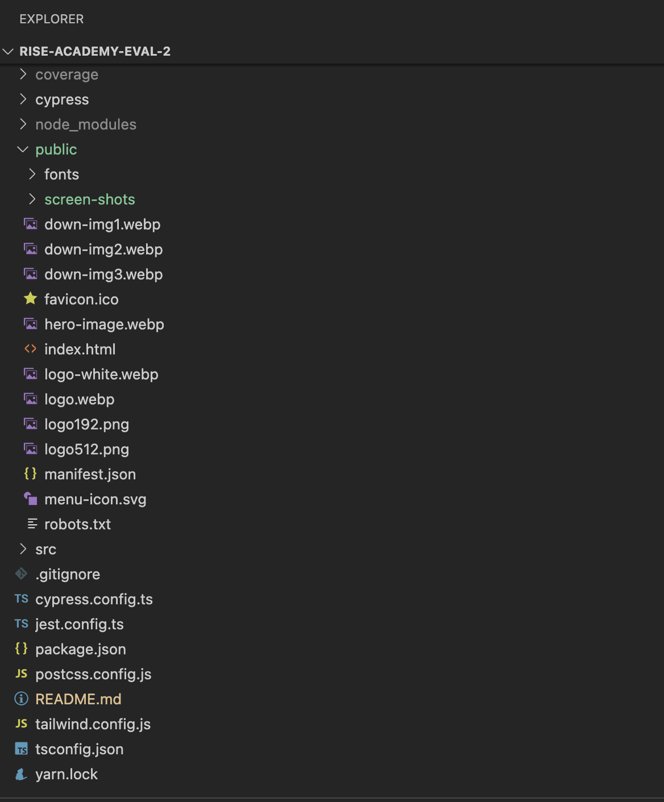
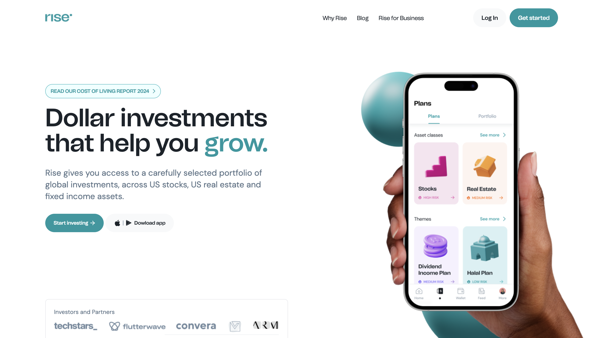
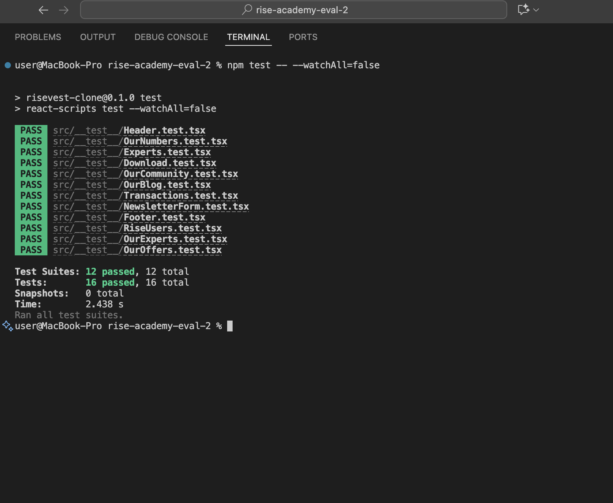
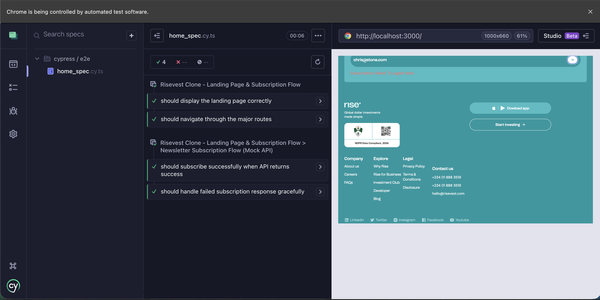
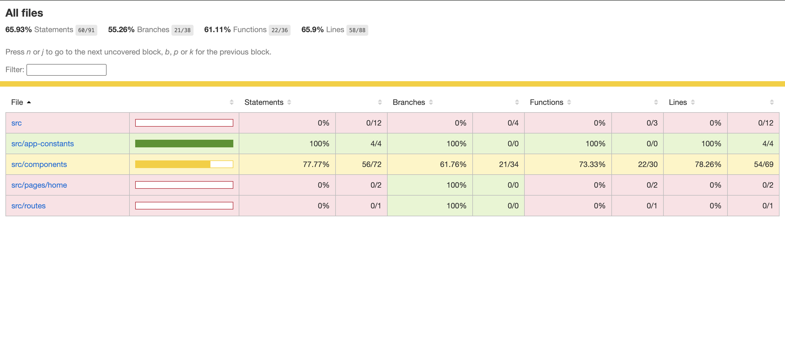

# Risevest Clone

A modern, responsive **Risevest landing page clone** built with **React.js**, **TypeScript**, and **Tailwind CSS**.  
It demonstrates best practices in UI design, routing, form validation, and end-to-end testing using **Cypress** and **Jest**.

---

## Overview

The project replicates the **Risevest** investment landing page experience.

This project emphasizes:
- **Frontend architecture best practices**
- **Clean, reusable components**
- **Comprehensive testing (unit + E2E)**
- **Well-documented code and setup**

---

## Key Features

* Responsive landing page (mobile and desktop)  
* Smooth navigation between routes (`/`, `/why-rise`, `/business`)  
* Newsletter subscription with form validation  
* Error and success states for user feedback  
* Mocked API integration for subscription flow  
* Comprehensive E2E and unit testing coverage  

---

## Tech Stack

| Category | Technology |
|-----------|-------------|
| **Framework** | React 18 |
| **Language** | TypeScript |
| **Styling** | Tailwind CSS |
| **Unit Testing** | Jest + React Testing Library |
| **E2E Testing** | Cypress |
| **Version Control** | Git + GitHub |
| **Deployment** | Vercel |

---

## Setup Guide

### Clone Repository
```bash
git clone https://github.com/OkoliChimarume/evaluation-2.git
cd risevest-clone
```

### Install Dependencies
```bash
npm install
```

### Run Development Server
```bash
npm run dev
```
## How to run test
### 1. Component testing (unit testing using jest)
```bash
npm run test
```
### 2. End to end Tests (Cypress)
```bash
npm run cypress
```

## Test Documentation

Testing focuses on core user journeys:

### Landing page rendering

Verifies hero, navigation, footer visibility.

1. Routing tests

Checks navigation between /, /why-rise, /business.

2. Newsletter subscription

Covers success and error flows.

3. Error handling & validation

Ensures invalid input is caught before submission.

### Test Limitations

Mocked API used instead of a live backend.

## Visual representation of application(folder structure)

| View                      | Screenshot                                            |
| ------------------------- | ----------------------------------------------------- |
| **Landing Page**          |           |
| **JEST Tests** |     |
| **Cypress Tests** |     |
| **Coverage Report**       |  |


## Deployed Link
[link](https://evaluation-2-psi.vercel.app/)